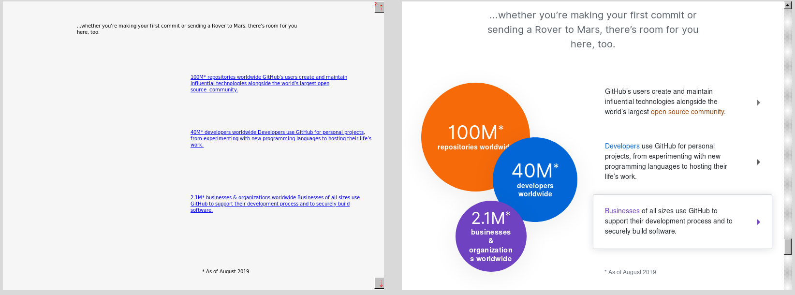

### Try out and use online

You can use this software online: [http://websnapper.waritschlager.de/howto](http://websnapper.waritschlager.de/howto)

*For detailed information about what all of this is, please go to this link or see the file `howto.html`.*

Example of what this software does, a 800x600 comparison of a scrolled down section of GitHub.com:

in this case, 1.1 KB vs. 36 KB

### ... or run the server locally

#### Docker image

Simply run e.g.

    docker run -p 80:8080 --rm -it --cap-add=SYS_ADMIN phil294/websnapper

Then, you can access in your browser at `localhost/howto` the same page as above, just locally.

#### Manual installation

To run this software yourself, here is what you need to do, for example on a VM, docker image, v-server or locally:

- Have nodejs and npm or yarn installed (using yarn below)
- Install the system dependencies for puppeteer: `sudo apt install -y gconf-service libasound2 libatk1.0-0 libc6 libcairo2 libcups2 libdbus-1-3 libexpat1 libfontconfig1 libgcc1 libgconf-2-4 libgdk-pixbuf2.0-0 libglib2.0-0 libgtk-3-0 libnspr4 libpango-1.0-0 libpangocairo-1.0-0 libstdc++6 libx11-6 libx11-xcb1 libxcb1 libxcomposite1 libxcursor1 libxdamage1 libxext6 libxfixes3 libxi6 libxrandr2 libxrender1 libxss1 libxtst6 ca-certificates fonts-liberation libappindicator1 libnss3 lsb-release xdg-utils wget` ([source](https://github.com/GoogleChrome/puppeteer/issues/3443#issuecomment-433096772))
- Make the package manager install the dependencies: `yarn`. This will also download a specific chromium browser module into your node_modules folder
- Run the server e.g. with `PORT=7001 yarn run start`

I will add a Docker image and build file later today and put it on here.

#### Enable Javascript

For JS to work, remove [this line](https://github.com/phil294/websnapper/blob/67c64d8e395cb3172be5e7896a8feb02c6b32d64/snap.coffee#L17) in your local version.
